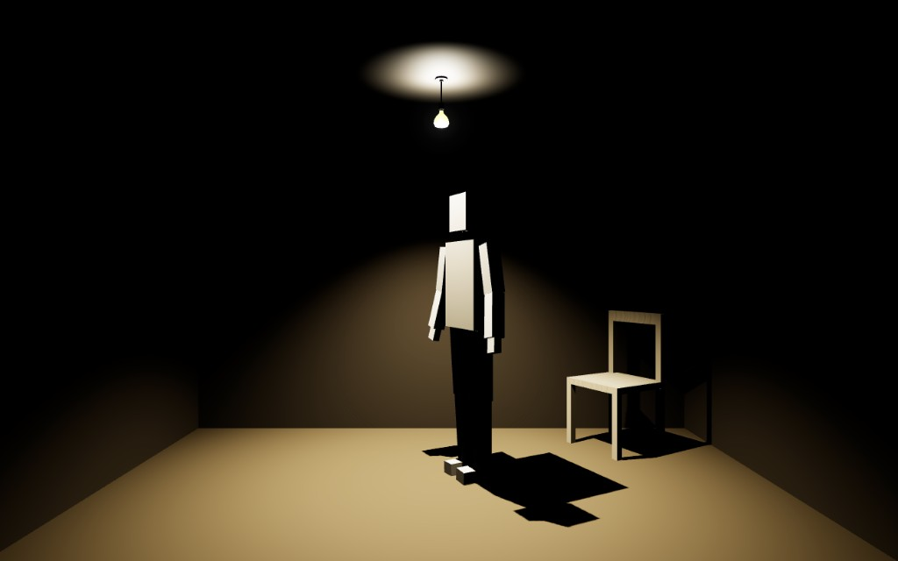

# Kijkdoos



A viewport-filling 3D shoebox (React Three Fiber + Three.js). One procedural block puppet, one chair, one hanging lamp. The remote brain only returns the next `{ action, target? }`. Locomotion, poses, collision, sit, and furniture run in the client.

Live: [kijkdoos.joris.wtf](https://kijkdoos.joris.wtf/).

```bash
npm install
npm run dev      # Vite + wrangler, http://localhost:5177
npm run build    # typecheck app + worker, then Vite build
npm run preview  # production build locally
npm run deploy   # build + wrangler deploy
```

## Split of work

| Layer | Owns |
| --- | --- |
| Client (`src/`) | Shoebox camera, block rig, keyed clips, nav, sit socket, chair tween, lamp yank, visit/mood persistence |
| Brain (`POST /api/think`) | Next plan from a `Snapshot`. Dummy heuristics or Workers AI |
| Worker (`worker/think.ts`) | That endpoint. SPA assets handle every other path (`run_worker_first: ["/api/*"]`) |

The browser never calls `dummyThink`. Every think tick is `fetch("/api/think")` (`src/brain/client.ts`). Vite uses `@cloudflare/vite-plugin`, so `/api/think` hits the worker in `npm run dev` as well as in production.

## Brain (Cloudflare Worker)

`wrangler.jsonc`: worker name `kijkdoos`, AI binding `AI` (remote), var `BRAIN` `"cf"` (default) or `"dummy"`.

- **`cf`:** Workers AI `@cf/meta/llama-3.1-8b-instruct-fast` (`max_tokens` 64, `temperature` 0.4, JSON schema `{ action, target? }`). The system prompt is a silent director: still more than idle, never invent objects or verbs, omit `mood` / `say`. Truncated Llama JSON is repaired if `"action"` is present. On throw, falls back to dummy.
- **`dummy`:** `src/brain/dummy.ts` — weighted random from mood, visit summary, advertised verbs, and `failedActions`. Immediate `glare` if `user.poked`.

Plans are `{ action, target? }`. Invalid action → 400. Unadvertised or unaffordable plan → `{ action: "idle" }`. The worker also fills a missing `target` when exactly one object offers that verb.

The scene asks for a plan every **8 s**, unless `walkBusy()` (walk, sit, stand, chair tween, one-shot, still hold, **wander rest**, turns) or `thoughts >= 40` (`THOUGHT_CAP`). After the cap, the last pose just continues. A finished `walk_to` occupies 8–18 s of still so the director cannot immediately reissue a wander.

### Actions

Self (no object required, never set `target`): `idle`, `still`, `fidget`, `walk_to`, `stand`, `wave`, `glare`, `look_at_user`, `emote`.

Object verbs must appear on that object’s `affordances` and set `target` to its id. A missing target is filled only when **exactly one** object offers that verb; two chairs that both advertise `sit` will not be guessed.

| Object | Verbs |
| --- | --- |
| Chair `chair-1` | `sit`, `push`, `move`, `kick` |
| Lamp `lamp-1` | `light_on` or `light_off` (the one that is not current) |

While seated, chair and lamp advertise nothing. `stand` is the only legal next object-related verb; the controller then may chain a lamp or chair verb.

Chair verbs (personality is not in this list — only room facts):

- seated → `[]`
- else always `sit`
- trapped or back blocked **and** in reach (`CHAIR_REACH` 0.85 m) → `kick` instead of `push`/`move`
- else `push` + `move`
- **peak anger** also advertises `kick` from far away (walk first)

`walk_to` is a wander to a clear floor point. It does not take an object target — approaching furniture is the object verb (`sit`, `push`, `light_off`, …).

`idle` is a looping weight-shift. **`still`** is a frozen hold (12–36 s). `emote` is a shrug.

### Snapshot

Each think POST (`src/brain/schema.ts`) includes:

- `objects` with live `affordances` and poses
- `character`: pose, seated, mood, energy (decays over time; dummy ignores it), pos
- `lastActions` (last 8 `{ action, target? }` traces)
- `user`: `stareSeconds` (hovering the canvas, production too), `poked` (dev click on the puppet)
- `mood`, `visitCount`, `lightOn`, `visitSummary`, `failedActions` (`{ action, target? }` that failed in this room state), `trappedChair`, `backBlocked`, `chairInReach`, `failCount`, `badChairPoses`

Mood is an input to the brain, not an output. The model/dummy does not set mood.

## Mood vs behaviour

**Mood** is derived from the visit log when a visit starts (`moodFromLog` in `src/visit.ts`). It is not a pose and not a brain output.

Last **40** visits (oldest dropped):

- empty log → `shy`
- last visit under 30 s → `angry`
- last visit ≥ 2 min, **or** at least 3 of the last 5 that long → `happy`
- otherwise → `calm`

**Peak anger** (far-away `kick` may be advertised): `failCount >= 3` this visit, or mood `angry` with a trailing short-visit streak ≥ 2. Three fails this visit also force live mood to `angry`.

**Behaviour** is the plan stream plus the boot tableau. Dummy weights still / glare / sit / lamp / kick from mood and summary fields:

- `shortStreak` — consecutive visits under 30 s
- `neverSatLast10`
- `darkHabit` — lamp off in at least 3 of the last 5 visits
- `pokeRateLast10`

A visit starts when the page is shown (`hydrateVisit`) and ends on `pagehide` or `visibilityState === "hidden"` (`endVisit`). Coming back starts a new visit.

## Boot tableau

On first `Controller.start`, the puppet is already in a still-life — not walking in from a spawn square. Mood-weighted chance of already sitting (shy high, angry low; `neverSatLast10` cuts it). Seated tableau picks still / look / idle / fidget. Standing tableau picks still / idle / look / fidget / glare; shy faces away from the camera, look/glare face the opening.

## Persistence

`localStorage` key `kijkdoos.visit.v1`:

- chair pose `{ u, v, yaw }` (floor UV: u left→right, v opening→back wall)
- `lightOn`
- visit log (endedAt, duration, poked, max stare, sat, lamp, mood)
- `badChair` poses that pinned the puppet against a wall (avoided on later `move`)

Furniture is also written mid-visit after a successful lamp yank or chair tween (`persistFurnitureNow`).

## Scene

- Ceiling **2.4 m**. Wide viewports widen the room; tall viewports keep a 2.4 m square opening and crop the side walls. Depth is `0.85 × min(width, height)`. Camera FOV 55°, looking into the open face.
- Stage is `position: fixed` to the visual viewport (mobile URL bar).
- Palette: kraft day (8:00–18:00) / cool night (20:30–5:30); dawn (~5:30–8:00) and dusk (~18:00–20:30) lerp. Mix from the viewer’s local clock, refreshed every 4 s. `?hour=` overrides in **dev only**.
- Lamp hangs 0.3 m below the ceiling at room center. Off keeps a dim fill (`OFF_FILL`) so the floor stays readable.
- Installable PWA (`public/site.webmanifest`, standalone). Marketing copy in `index.html` / the manifest stays out of this README.

### Puppet

Procedural boxes (`src/actor/blockBody.ts`), ~1.7 m. Hand-keyed clips (`src/actor/poses.ts` + `clips.ts`), not Mixamo/GLTF. `Controller` owns world `x,z,yaw`, pathing, sit, and furniture. `PosePlayer` plays clips; `Resident` ticks both each frame.

Sit: walk to `chairSitEntry` (open floor in front of the seat), snap hips to `chairSitPoint` (front of the seat), play sit **in place**. Stand: play the stand clip at the entry so legs do not unfold through the chair. No interpolated slide into the backrest.

Nav routes around the chair’s rotated footprint (`src/scene/nav.ts`). A blocked step sidesteps rather than walking into it.

### Chair and lamp

Chair default is the right-back corner, yaw −60°.

- **`push`:** walk behind the backrest, grip, tween a short slide (same yaw).
- **`move`:** same approach, then a random legal pose (yaw can change). Skips `badChair` and poses that trap the puppet.
- **`kick`:** stand on the wall-facing side; the chair slides into the room, never toward the kicker’s feet. Used when trapped / back blocked, or under peak anger from across the room.

Failed rearrange plans stay in `failedActions` as `{ action, target }` until room state changes (the dummy/LLM should not retry that pair). If a kick is the only chair verb advertised while trapped, dummy prefers it.

Lamp: walk to room center, play pull, toggle `lightOn`. Dummy rarely picks lamp verbs; angry / dark-habit bias toward off, happy toward on.

## Dev controls

Production has **no** click or keyboard cheats. Hover-stare is real in production: pointer over the canvas increments `stareSeconds`. Clicking the puppet (dev) sets `poked` for the next think tick.

In `npm run dev`, clicks and keys are enabled and printed to the console.

| Input | Action |
| --- | --- |
| Click floor | walk there |
| Click chair | sit |
| Click puppet | glare + poke |
| Hover canvas | count as staring (production too) |
| W | wave |
| G | glare |
| F | fidget |
| L | look at the camera |
| E | emote (shrug) |
| I | still |
| S | sit |
| X | stand |
| O | toggle lamp |
| P | push chair |
| M | move chair |
| K | kick chair |
| `?hour=13` / `?hour=1` | preview day / night |

## Layout

```
src/brain/          schema, dummy, client fetch
src/actor/          Controller, block rig, poses, clips, pose player
src/scene/          shoebox, room, chair, lamp, nav, Resident, Kijkdoos
src/visit.ts        mood, visit log, localStorage
src/theme.ts        day/night palettes
worker/think.ts     /api/think
wrangler.jsonc      BRAIN, AI binding, SPA assets
```

## Deploy

```bash
npm run deploy
```

`vite build` (Cloudflare plugin) then `wrangler deploy`. Worker name `kijkdoos`. Assets are the SPA; only `/api/*` runs the worker first. The AI binding is remote.

Switch brains with `"BRAIN": "dummy"` or `"cf"` in `wrangler.jsonc` vars.